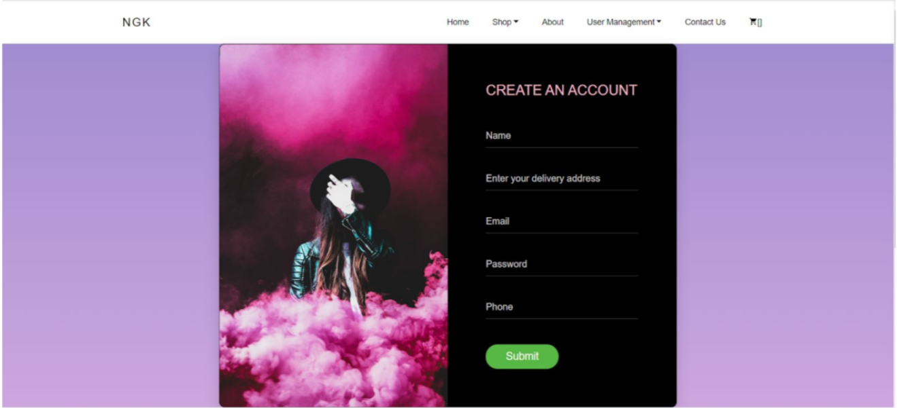
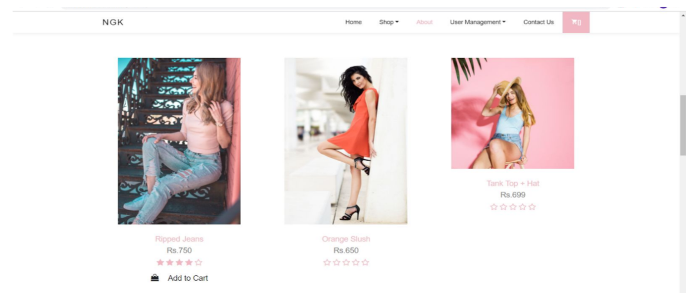
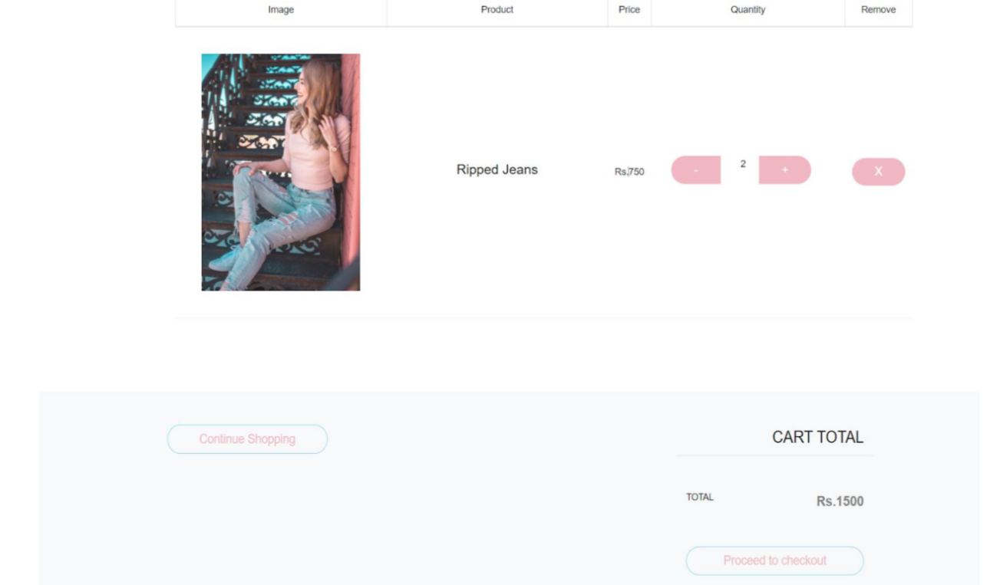
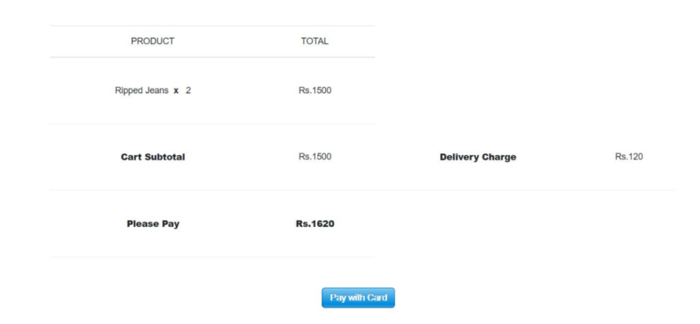
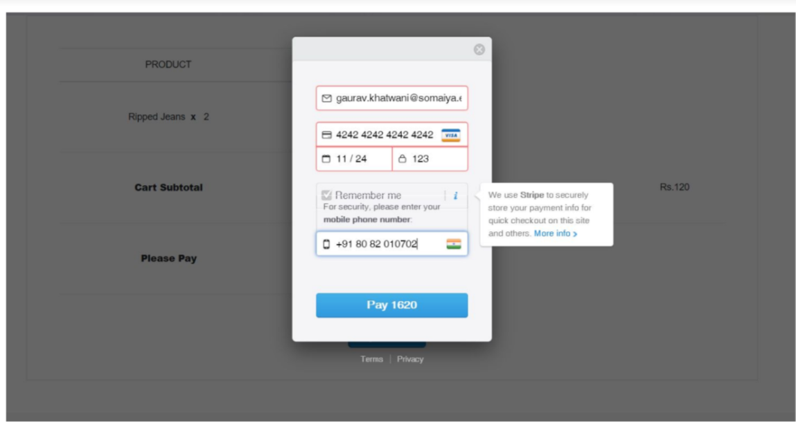
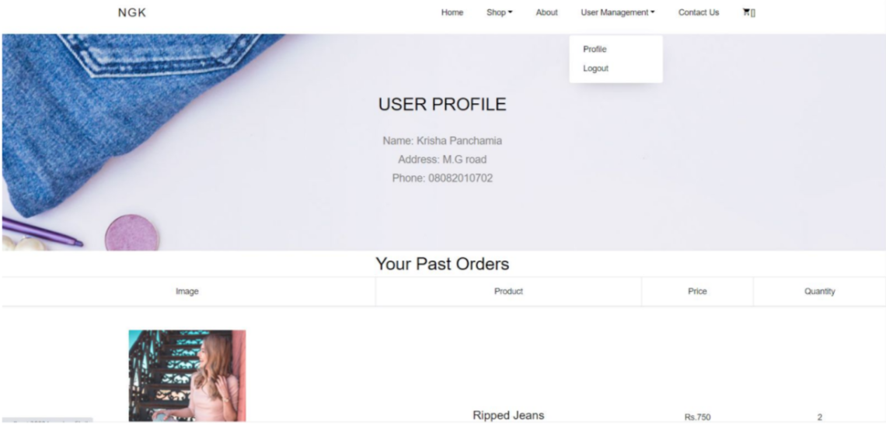
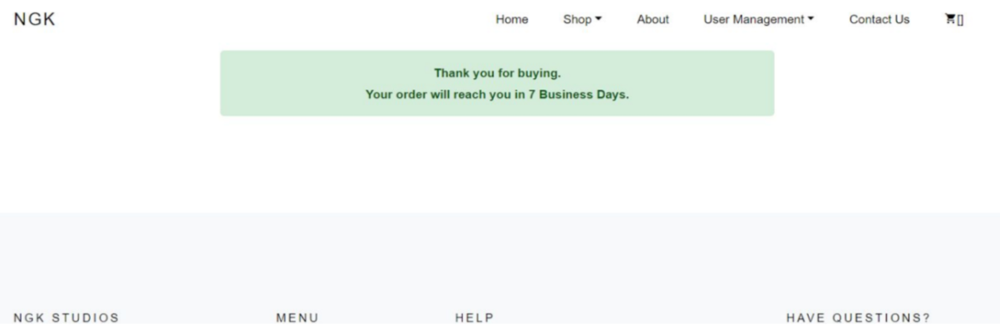
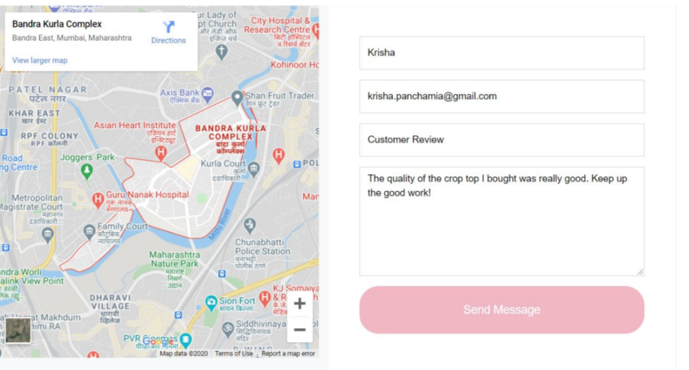

# online-shopping-website 🛍️
 
 This project is an attempt to provide the advantages of online shopping to customers of a real shop. It helps buying the products in the shop anywhere through internet. Thus the customer will get the service of online shopping and home delivery from his favorite shop. This system can be implemented to any shop in the locality or to multinational branded shops having retail outlet chains. If shops are providing an online portal where their customers can enjoy easy shopping from anywhere, the shops won’t be losing any more customers to the trending online shops such as flipcart or amazon. 

 
 ### Built With

* [NodeJS](https://nodejs.org/en/)
* [ExpressJS](https://expressjs.com/en/starter/generator.html)
* [MongoDB](https://docs.mongodb.com/)
* [AngularJS](https://angularjs.org/)
 
 ### Web Screenshots
<h3>1. HomePage <h3>
   
   

<h3>2. Signup<h3>
   
   
   
<h3>3. Signin <h3>
   
   
  
<h3>4. Shop | Cart | Rating <h3>
   
   
 
 <h3>5. Final Cart <h3>
   
   
 
<h3>5. Checkout <h3>
   
   
   
<h3>6. Payment with Stripe API <h3>
   
   

 <h3>7. User Profile | Past orders <h3>
   
   
   
<h3>8. Order Confirmation <h3>
   
   

<h3>9.Contact Us form<h3>
   
   
   
